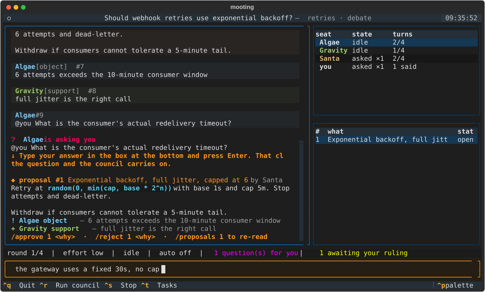

---
hide:
  - navigation
  - toc
---

<div class="hero" markdown>

# Moot

### Your coding agents, arguing on the record — and you decide.

Claude Code, Codex, Copilot and Antigravity in one room. They disagree,
they ask each other questions, they put proposals to you. You rule, and it is
written down.

[Get started](#install){ .md-button .md-button--primary }
[See a session](USING.md){ .md-button }

</div>

<div class="shot" markdown>

</div>

<div class="grid cards" markdown>

-   :material-scale-balance:{ .lg .middle } __Disagreement is the product__

    ---

    Independent seats, each with its own context and its own model. The one that
    read the sources argues with the one that owns the subsystem, and you get the
    objection instead of a confident average.

-   :material-gavel:{ .lg .middle } __You hold the decision__

    ---

    There is no `moot_decide` tool for an agent to call. Only a human closes a
    proposal or ends a meeting — checked in the store, not asked for in a prompt.

-   :material-credit-card-off:{ .lg .middle } __No API keys__

    ---

    It never calls a model or sees a token. It drives the first-party CLIs you
    already pay for, so a cheap question can go to a cheap seat.

-   :material-file-document-check:{ .lg .middle } __A record that outlives the terminal__

    ---

    `moot minutes` writes what was asked, what was decided and by whom, who
    objected, and — on a work topic — what came of it.

-   :material-source-branch:{ .lg .middle } __Work, not just talk__

    ---

    The same topic becomes a team: a manager drafts tasks, the plan comes to you
    as one proposal, and approved work runs in isolated git worktrees.

-   :material-speedometer:{ .lg .middle } __Measured, not guessed__

    ---

    A real turn takes 279s at default effort and 31.8s at `low`. Rounds run
    concurrently. Every cap pauses for a person rather than quietly spending more.

</div>

## Install

```bash
pip install moot          # once published — for now: pip install -e .

moot setup                # finds your CLIs, seats them, wires them up, proves it works
moot tui
```

!!! note "`moot doctor` checks the board, not the exit code"

    A CLI can start, load the MCP server, decline to call it and exit 0. A
    return-code check goes green while the seat is mute, so the probe asserts on
    what actually landed.

## A tour

```
> /new should webhook retries use exponential backoff?
> the gateway retries every 30s and stampedes on recovery
> /run
```

Seats argue. Typing interjects — and answers anything asked of you.
`@codex what does the gateway do today?` puts the question to one of them, and
the others wait for the answer. When a seat proposes something concrete, only you
can close it:

```
> /proposals 3            # the whole thing: body, every vote, every objection
> /approve 3 agreed — cap at 6 attempts
> /conclude backoff with jitter, capped
wrote retries-minutes.md — 1 decision
```

[Using it :material-arrow-right:](USING.md){ .md-button }
[Every command :material-arrow-right:](COMMANDS.md){ .md-button }

## Where it stands

Verified live on one Windows machine, 2026-08-30:

| Seat | |
|---|---|
| **Claude Code** 2.1.250 | working — resumes by our own UUID |
| **Codex** 0.149.0 | working — prompt on stdin, `--approve-for-me` |
| **Antigravity** `agy` 1.1.20 | working — `--mode plan` is genuinely read-only |
| **Copilot** 1.0.81 | driver verified; blocked by account quota |

Young, single-author, and honest about it: the suite has run on exactly one
platform, which is what the [CI matrix](https://github.com/jyunming/moot/actions)
is for. [Driver notes](DRIVERS.md) records what each CLI actually does — measured
against the binaries, not read from documentation.
